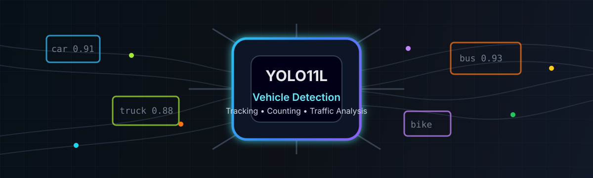

  

<h1 align="center">Hi, I'm Taufiq</h1>

  Informatics student focused on machine learning, computer vision, and YOLO-based vehicle detection.

  
  

---

### About Me

- Informatics student with an interest in AI and software development.
- Currently building a YOLO11L vehicle detection and tracking system.
- Interested in computer vision, desktop applications, databases, and automation.
- Learning how to make practical machine learning projects easier to use.

### Tech Stack

  
  
  
  
  

### Featured Project

#### YOLO11L Deteksi & Tracking Kendaraan

Desktop application for vehicle detection, tracking, counting, and traffic analysis using YOLO11L.

  

### Contribution Snake

  

